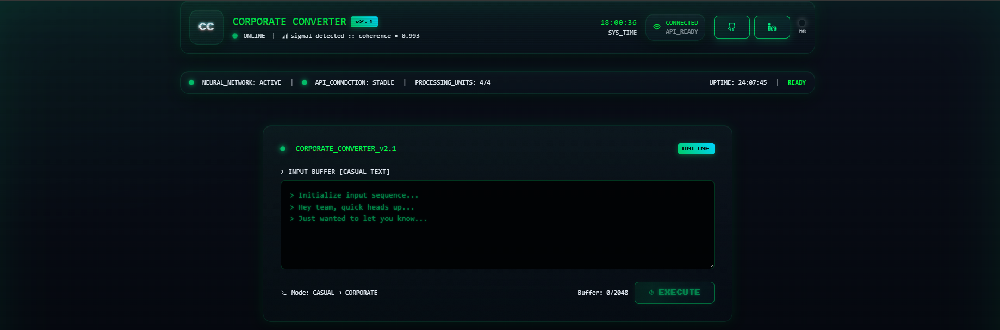

# Corporate Translator 🖥️⚡

A **text conversion tool** that transforms casual English into polished, professional corporate communication.
Built with **Next.js** and styled with **TailwindCSS**, a retro CRT-terminal aesthetic.

<br>




<br>

### Corporate Translator - [[link](https://corporate-translator-liard.vercel.app/)]

### 🚀 Getting Started

### Prerequisites

* Node.js 18+
* npm or yarn

### Installation

```bash
# Clone the repo
git clone https://github.com/your-username/corporate-converter.git
cd corporate-converter

# Install dependencies
npm install

# Run in development
npm run dev
```

Then open **[http://localhost:3000](http://localhost:3000)** in your browser.


### 🛠️ Tech Stack: Next.js (App Router) + Tailwind CSS + custom retro UI components


## 📱 Contact

### [✉️ Email]()
### [🔗 LinkedIn](https://www.linkedin.com/in/arindalchar/)
### [✖️ Twitter](https://www.twitter.com/arindal_17)
